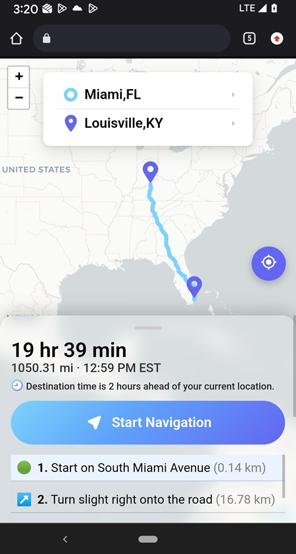

# Browser-Based GPS Navigation App
A lightweight, real-time navigation system built with Leaflet and OpenStreetMap, delivering modern GPS functionality directly in the browser — no native app required.

**✨ Features**

**🗺 Interactive Mapping**
- Dynamic route rendering
- Responsive bottom navigation panel
- Custom route styling
- Recenter map functionality

**🚦 Turn-by-Turn Navigation**
- Step-by-step maneuver instructions
- Cleaned & merged routing steps
- Active maneuver header
- Navigation lifecycle management

**📍 Live GPS Tracking**
- Real-time user location updates
- Continuous route progress monitoring
- Smart rerouting support
- Smooth map recentering

**⏱ Live ETA Engine**
- Remaining distance calculation
- Real-time arrival updates
- Smart duration formatting (hrs/min)
- Miles conversion
- Time zone–aware arrival time display

**🌎 Time Zone Intelligence**
- Automatic destination time zone detection
- DST-aware ETA formatting
- Time zone abbreviation display (PST, MST, etc.)
- “X hours ahead/behind” alert system

**📱 Mobile-Optimized UX**
- Keyboard-triggered route search (Enter key)
- Auto keyboard dismissal on mobile
- Map-centered loading spinner overlay
- Responsive UI design

**🛠 Built With**
- **Leaflet.js** – Interactive maps
- **OpenStreetMap** – Map tile data
- **OSRM Routing API** – Route calculations
- **Vanilla JavaScript** – Core logic
- **Nominatim** – Geocoding service

**🚀 How It Works**
1. User enters a starting and destination address.
2. Addresses are geocoded using Nominatim.
3. Route data is fetched from the OSRM routing service.
4. Route polyline is rendered on the map.
5. Turn-by-turn steps are cleaned and displayed.
6. ETA and arrival time are calculated (time zone aware).
7. Live GPS tracking updates distance and progress.

**🧠 Technical Highlights**
- Promise-based geocoding and routing flow
- Cleaned maneuver merging logic
- Dynamic panel height adjustments
- Custom map markers
- Overlay-based loading system
- Time zone comparison engine
- Real-time ETA recalculation loop

**Notes**
- Uses public routing and geocoding services (rate limits may apply).
- GPS functionality requires browser location permission.
- Best tested in modern Chrome and Safari browsers.

**License**
MIT License — Free to use and modify.
